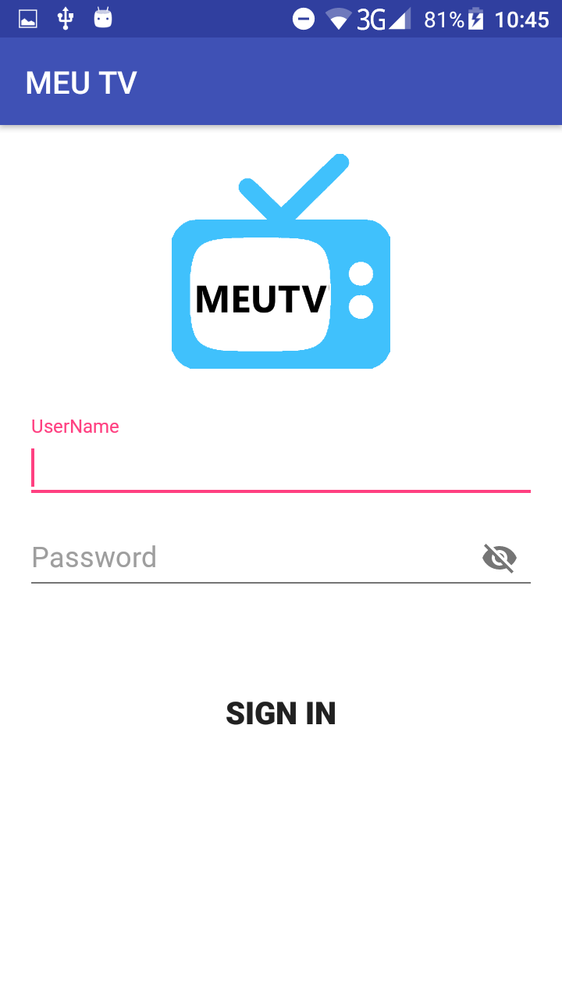
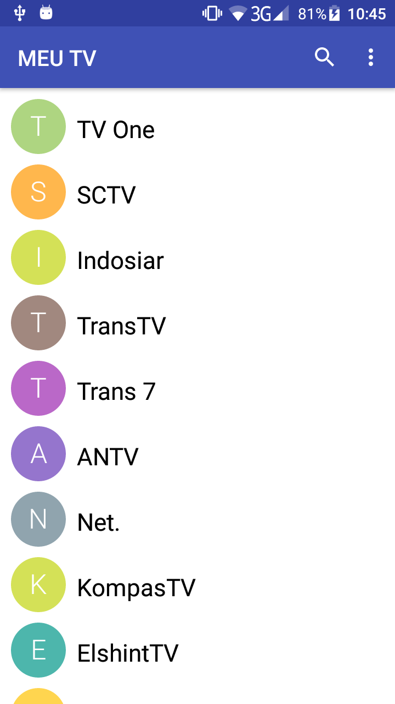
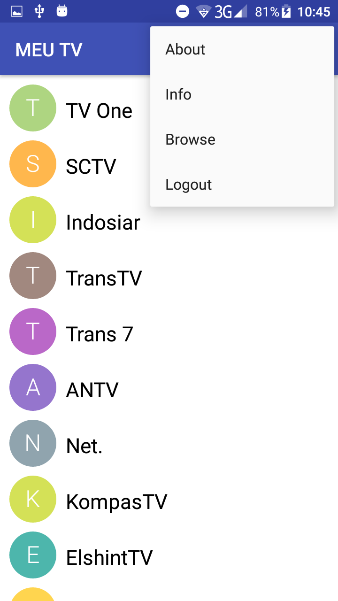

# MEU-TV
Android project for live streaming. With this app we can fetch channels from links Or from file(M3U8 / M3u) & Show in Grids Or as columns.
Select an Channel to play.
Channel list is Obtained from List Provided.
Reading M3U / M3U8 file & displaying Channels.

***Contributions | Contributors are welcome*** 👍😍

* Future Updates
- [x] Exo Player Included
- [ ] MxPlayer Integration
- [ ] Screen Cast

***Screenshots***

    
    
    

